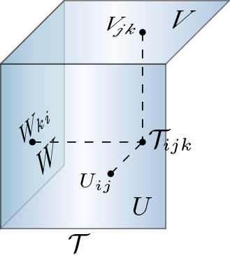

# Tensor-Decomposition-with-Matrix-Outer-Product
Matlab Implementation for the paper:

Luo, Q., Yang, M., Li, W., & Xiao, M. (2023). Multidimensional Data Processing with Bayesian Inference via Structural Block Decomposition. *IEEE Transactions on Cybernetics*, [10.1109/TCYB.2023.3234356](https://doi.org/10.1109/TCYB.2023.3234356).

- **Matrix Outer Product**

The matrix outer product among $U\in \mathbb{R}^{n_1\times n_2}, V\in \mathbb{R}^{n_2\times n_3}$ and $W\in \mathbb{R}^{n_3\times n_1}$ is denoted as: $$\mathcal{T} = U \bullet V \bullet W \in \mathbb{R}^{n_1\times n_2\times n_3},$$
with the $(i,j,k)$-th entry of $\mathcal{T}$  being defined as 
```math
\mathcal{T}_{ijk} = U_{ij}V_{jk}W_{ki},
```

where $i=1,2,\cdots n_1;~j=1,2,\cdots,n_2;~k=1,2,\cdots, n_3$. The graphical illustration of the matrix outer product is shown as follows.

<p align="center">

<p>

- **Tensor Product**

Let $\mathcal{X}\in \mathbb{R}^{n_1\times n_2 \times m}$, $\mathcal{Y}\in \mathbb{R}^{m\times n_2 \times n_3}$ and $\mathcal{Z}\in \mathbb{R}^{ n_1\times m \times n_3}$, the product of $\mathcal{X}$, $\mathcal{Y}$ and $\mathcal{Z}$ on matrix outer product is:
```math
\mathcal{A} = \mathcal{X} \bullet_1 \mathcal{Y} \bullet_2 \mathcal{Z} = \sum_{l=1}^{m} \mathcal{X}_{:,:,l}\bullet \mathcal{Y}_{l,:,:}\bullet (\mathcal{Z}_{:,l,:})^T \in \mathbb{R}^{n_1\times n_2 \times n_3},
```
where $\bullet$ is the matrix outer product.

- **Tensor Approximation**

For a  given third-order tensor $\mathcal{A}\in \mathbb{R}^{n_1\times n_2\times n_3}$, its  rank - $r$  decomposition  based on matrix outer product can be  conducted by minimizing the following quadratic cost function:
```math
    \arg\min_{\mathcal{U}, \mathcal{V}, \mathcal{W}} 
    \frac{1}{2} \|\mathcal{A} - \mathcal{U}\bullet_1 \mathcal{V}^{S_1}\bullet_2 \mathcal{W}^{S_2}\|_F^2,
```
where $\mathcal{U}\in \mathbb{R}^{n_1\times n_2\times r}$, $\mathcal{V}\in \mathbb{R}^{n_2\times n_3\times r}$, $\mathcal{W}\in \mathbb{R}^{n_3\times n_1\times r}$,  and $\mathcal{V}^{S_1}, \mathcal{W}^{S_2}$ represent the corresponding tensor shifts.


- **Tensor Completion**

Let $\mathcal{A}\in \mathbb{R}^{n_1\times n_2\times n_3}$ be a partially observed third-order tensor, and $\Omega$ be the index set of observed entries, i.e., $\Omega_{ijk}=1$ if $\mathcal{A}_{ijk}$ is observed and 0 otherwise.  The $(i,j,k)$-th element in $\mathcal{A}$ is approximated by 

```math
    \begin{aligned}
    \hat{\mathcal{A}}_{ijk} = \sum_{l=1}^r \mathcal{U}_{ijl}\mathcal{V}_{jkl}\mathcal{W}_{kil},
    \end{aligned}
```
where $\mathcal{U}\in\mathbb{R}^{n_1\times n_2\times r}$, $\mathcal{V}\in\mathbb{R}^{n_2\times n_3\times r}$ and $\mathcal{W}\in\mathbb{R}^{n_3\times n_1\times r}$ are three factor tensors of $\hat{\mathcal{A}}$. Now suppose every observed entry of $\mathcal{A}$,  denoted by $\mathcal{A}_{ijk}$, follows the independent Gaussian distribution, i.e.,

```math
    \mathcal{A}_{ijk} \sim  \mathscr{N}(\hat{\mathcal{A}}_{ijk}, \alpha^{-1}),
```
where $\mathscr{N}(\mu, \alpha^{-1})$ denotes the Gaussian distribution with the mean $\mu$ and the precision $\alpha$.

- **Tensor RPCA**

Assume $\mathcal{Y}\in \mathbb{R}^{n_1\times n_2\times n_3}$ is the observed corrupted tensor that can be represented as three  different parts: the low-rank component $\mathcal{X}$ in the sense of the matrix outer product, the sparse component $\mathcal{S}$ that denotes the outliers or salient object, and the noise component $\mathcal{E}$ which is assumed to be Gaussian, i.e. $\mathcal{E} \sim \prod_{i,j,k}\mathscr{N}(\mathcal{E}_{ijk}, \tau^{-1})$ with a noise precision $\tau$. Specifically, the representation of $\mathcal{Y}$ is of the form: 

```math
    \mathcal{Y} = \mathcal{X} + \mathcal{S} + \mathcal{E},
```
where $\mathcal{X} = \mathcal{U}\bullet_1\mathcal{V}^{S_1}\bullet_2\mathcal{W}^{S_2}$, with $\mathcal{U}\in \mathbb{R}^{n_1\times n_2\times r}$, $\mathcal{V}\in \mathbb{R}^{n_2\times n_3\times r}$, $\mathcal{W}\in \mathbb{R}^{n_3\times n_1\times r}$, and $r$ denotes the rank. Next, to formulate the robust probabilistic model with  the tensor decomposition on the matrix outer product, some generic model assumptions will be placed on different terms. 

Given the model parameters $\mathcal{U}$, $\mathcal{V}$, $\mathcal{W}$, $\mathcal{S}$ and $\tau$,  the conditional distribution of observed tensor $\mathcal{Y}$ is given by:

```math
\begin{aligned}
    p(\mathcal{Y}|\mathcal{U,V,W,S}, \tau)= \prod_{i,j,k}\mathscr{N}(\mathcal{Y}_{ijk}|\sum_{l=1}^r \mathcal{U}_{ijl}\mathcal{V}_{jkl}\mathcal{W}_{kil} + \mathcal{S}_{ijk}, \tau^{-1}).
\end{aligned}
```

### Applications
- Tensor Aprroximation
  - Synthetic: `demo_als_synthetic.m`
- Tensor Completion
  - HSI Completion: `demo_tc_hyperspectral_data.m`
  - Traffice Data Imputation: `demo_tc_traffic_data.m` 
- Tensor RPCA
  - HSI/MSI denoising: `demo_rpca_hyperspectral_data.m`
  - Background Subtraction: `demo_rpca_background_subtraction.m`
    
 ### Folders
 - `algs` includes only the proposed methods.
 - `data` contains datasets.
    - `HSI`: [hyperspectral](https://rslab.ut.ac.ir/data)/[multispectral](https://cave.cs.columbia.edu/repository/Multispectral) images;
    - `traffic_data`: [PeMS](https://github.com/VeritasYin/STGCN_IJCAI-18) traffic speed data set and [Guangzhou](https://zenodo.org/record/1205229) urban traffic speed data set;
    - `dataset2014`: **download** from [Google Drive](https://drive.google.com/drive/folders/1zSKbx33XvPK872dLHe5YViXZ2HwkyCYS?usp=sharingg) or [ChangeDetection.net(CDNet) dataset2014](http://changedetection.net/).
        > Wang Y, Jodoin P M, Porikli F, et al. CDnet 2014: An expanded change detection benchmark dataset[C]//Proceedings of the IEEE conference on computer vision and pattern recognition workshops. 2014: 387-394.
- `utils` includes some utilities scripts.

